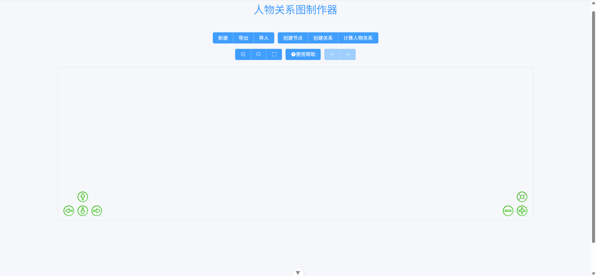
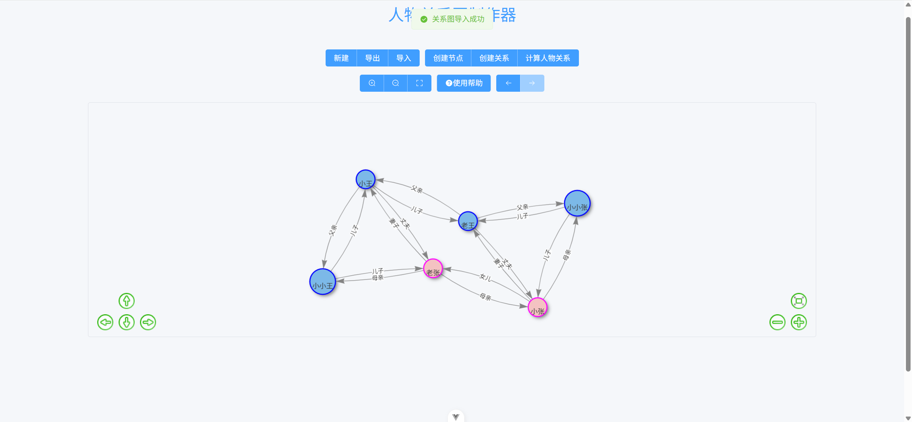
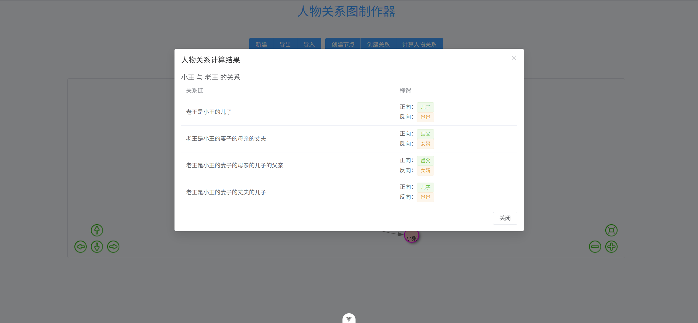
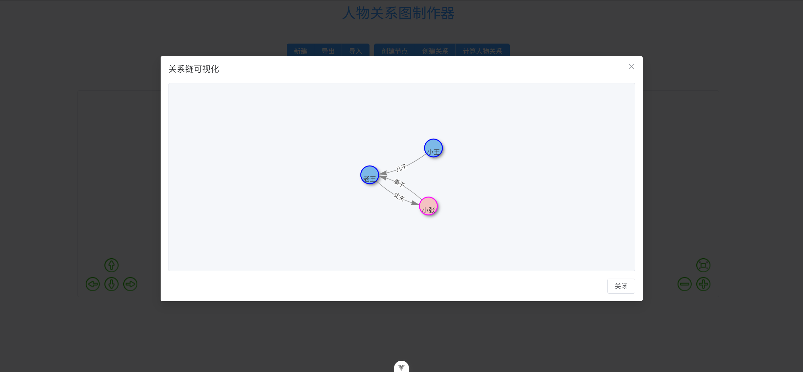

# 人物关系图制作器 (Relationship Graph)

一个基于Vue 3和vis-network的交互式人物关系图制作工具，可以创建、编辑、计算和可视化人物之间的关系网络。

## 项目截图

### 主界面



### 导入节点



### 关系计算



### 关系链可视化



## 技术栈

- Vue 3 - 前端框架
- Vite - 构建工具
- Element Plus - UI组件库
- vis-network - 网络图可视化库
- relationship.js - 中文人物关系计算库
- Web Workers - 用于处理复杂计算

## 安装指南

### 普通安装

1. 克隆项目

   ```bash
   git clone <repository-url>
   cd relationship-graph
   ```

2. 安装依赖

   ```bash
   npm install
   ```

3. 开发环境运行

   ```bash
   npm run dev
   ```

4. 构建生产版本

   ```bash
   npm run build
   ```

### Docker安装

1. 构建Docker镜像

   ```bash
   docker build -t relationship-graph .
   ```

2. 运行Docker容器

   ```bash
   docker run -d -p 80:80 relationship-graph
   ```

3. 访问应用
   在浏览器中打开 `http://localhost:80`

## 资源路径前缀配置说明

本项目支持在打包时通过参数配置资源路径前缀，使得打包后的文件中开头为"/assets/..."的路径会被修改为"/参数/assets/..."。

### 使用方法

#### 使用npm命令行

```bash
# 使用自定义构建命令并传递base参数
npm run build:custom --base=your_path_prefix
```

例如，如果你想将资源路径前缀设置为"app"，则可以运行：

```bash
npm run build:custom --base=app
```

这样，打包后的文件中，所有"/assets/..."的路径都会被修改为"/app/assets/..."。

#### 使用Docker构建

如果你使用Docker构建项目，可以通过构建参数传递路径前缀：

```bash
# 构建Docker镜像并传递BASE_PATH参数
docker build --build-arg BASE_PATH=your_path_prefix -t relationship-graph .
```

例如，如果你想将资源路径前缀设置为"app"，则可以运行：

```bash
docker build --build-arg BASE_PATH=app -t relationship-graph .
```

### 注意事项

1. 如果不传递参数，则资源路径前缀默认为空，即保持原始的"/assets/..."路径。
2. 参数值不需要包含前导和尾随斜杠，系统会自动处理。
3. 该功能主要用于在不同的部署环境中调整资源路径，例如当应用部署在子目录而非根目录时。

## 功能描述

### 基本操作指南

1. **创建节点**  
   点击"创建节点"按钮，在弹出框中填写人物的姓名、性别、年龄、描述、头像图片URL，点击"确定"按钮进入创建节点模式，然后点击画布空白处在鼠标光标处创建人物节点。

2. **修改/删除节点**  
   右击人物节点可以选择修改人物节点信息或删除人物节点。

3. **创建关系**  
   点击"创建关系"按钮进入创建关系模式，依次点击人物节点A和人物节点B，在弹出框中填写关系名称，点击"确定"按钮创建人物节点间关系。（A为关系起点，B为关系终点，关系名称应为“B对A的称谓”）

4. **修改/删除关系**  
   点击关系线可以选择修改关系或删除关系。

5. **文件操作**  
   页面上有新建（清空当前人物关系图）、导出（将当前关系图导出为JSON文件）、导入（选择JSON文件，判断文件是否为人物关系图，如果是则清空当前人物关系图，并根据JSON文件绘制人物关系图。如果不是则弹出错误警告）按钮。

6. **视图控制**  
   页面上有放大、缩小、适应屏幕按钮，用于调节人物关系图大小。

7. **计算人物关系**  
   点击"计算人物关系"按钮进入计算人物关系模式，依次点击人物节点A和人物节点B，在弹出框中查看A和B之间的所有关系链及称谓。点击某一条关系链时，会显示此条关系链的关系图。

8. **撤销/恢复**  
   使用前一步和后一步按钮可以撤销和恢复操作。

### 显示说明

- 人物节点为圆形，在人物节点下方显示人物姓名。
- 如果有头像图片URL，则圆形内填充头像图片，否则为纯色。
- 人物节点间关系线显示箭头，并在关系线中间显示关系名称。

## 许可证

MIT
